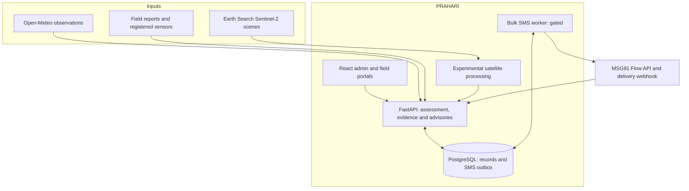
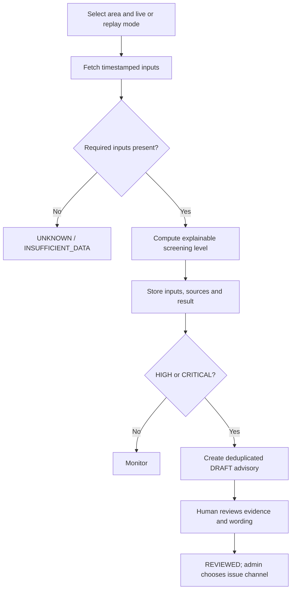
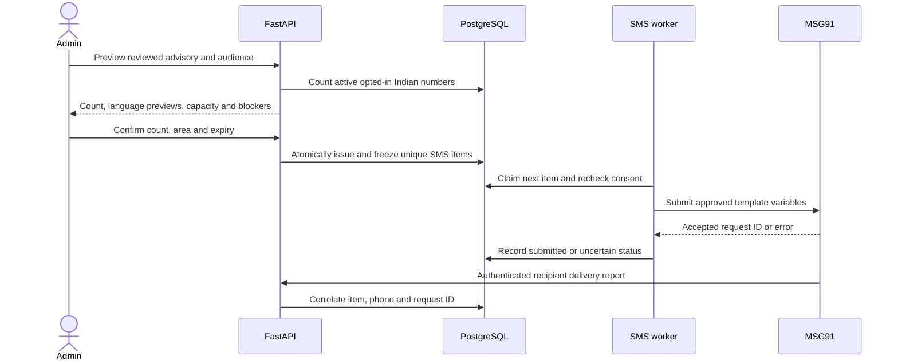
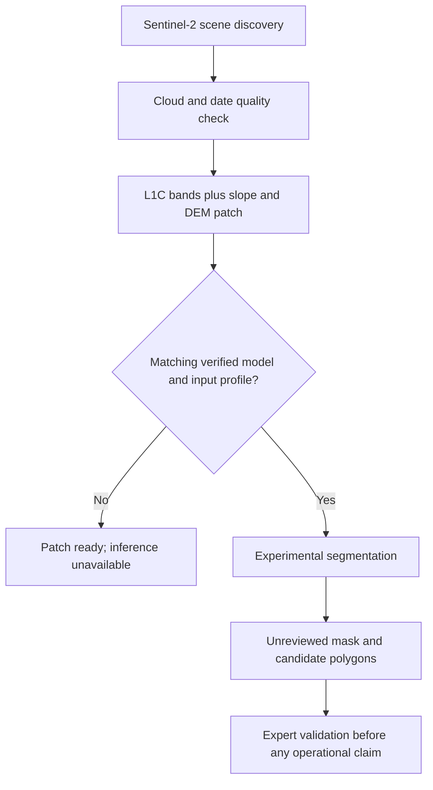

# PRAHARI system design

**Scope:** SIH26001 landslide decision support for selected Northeast India locations. This design describes the repository after the MSG91 bulk integration in PR #6. A risk result is a screening assessment; a message is an advisory that requires a human decision. PRAHARI is not an official warning authority.

## 1. System at a glance

The deployed React site and FastAPI server are separate Render services. The hosted database uses external PostgreSQL (Neon); SQLite is for local development only. The repository's `render.yaml` defines the static site and a free web API, **not** an always-on SMS worker or a satellite inference service. The broadcast feature flag is off by default. This diagram shows integration boundaries, not evidence that every external component is configured live.

## 2. Modules and contracts

| Boundary | Current implementation | Trust and failure rule |
| --- | --- | --- |
| Operator interface | `frontend/src/App.jsx`, `BroadcastPanel.jsx`, `SatelliteIntelligence.jsx`; admin and posting-bound field views | Server rechecks roles and location. Frontend state is not authorization. |
| Live source adapter | `main.py` fetches Open-Meteo, records source timestamps and caches responses | `CURRENT`, `STALE`, `MISSING`, `HISTORICAL_REPLAY` stay distinct. Missing required inputs produce UNKNOWN. |
| Assessment engine | `risk_baseline.py` interpretable thresholds and screening index; experimental ensemble in `backend/ml` | Index is not calibrated landslide probability; seeded slope/terrain context is demo data. |
| Advisory workflow | `main.py` stores assessments, draft alerts, transition audit and evidence reports | High/critical assessment may draft; it cannot send public SMS by itself. |
| Persistent store | `database.py`, `database_schema.py` connect to PostgreSQL in hosting | Consent, alert, audit, queue and receipt changes are durable; no silent fallback to SQLite when database URL exists. |
| Broadcast outbox | `broadcast_api.py`, `broadcasts.py`, `broadcast_worker.py` | Admin previews and confirms; worker rechecks consent and rate gate; unknown submissions require investigation. |
| SMS delivery | `msg91_provider.py` Flow API; authenticated `/api/notification/msg91/status` webhook | Provider acceptance is not delivery. DLT-approved sender and templates plus worker are prerequisites. |
| Satellite research | `satellite_preprocess.py`, `satellite_engine.py`, `satellite_jobs.py` | Scene discovery and patch preparation exist; inference needs compatible verified weights and input profile. Results are unreviewed post-event candidates. |

### Data ownership

| Data | Authoritative location | Retention and access decision |
| --- | --- | --- |
| Locations and baseline terrain | Seed constants in API | Demo context; replace with versioned geographic datasets before operational use. |
| Source cache and assessments | `source_cache`, `assessments` | Retain source state, time, inputs and result together; monitor stale source age. |
| Reports and evidence | `reports`; optional file on API filesystem | Report metadata persists; uploaded files on ephemeral hosting need durable object storage. |
| People and consent | `notification_recipients` | Field officer limited to posting; admin oversight; document consent source and revocation. |
| Advisories and actions | `alerts`, `alert_audit`, `system_events` | Every transition records actor role and time. |
| Broadcast and receipts | `broadcast_jobs`, `broadcast_items`, `broadcast_runtime`, `notification_deliveries` | One `(alert, phone)` queue entry prevents repeat send; provider receipt confirms delivery. |

## 3. Assessment to alert

The existing alert state machine is `DRAFT → REVIEWED → ISSUED → ACKNOWLEDGED → RESOLVED`, with a direct resolution path from earlier states. Review, issue and resolution are separate decisions. The field officer records evidence and enrolls consenting households in their assigned posting; admin has the cross-area view. Historical replay must retain its label on the assessment and must not be presented as live evidence.

## 4. Bulk advisory delivery

**Safety and capacity:** Worker heartbeat, configured provider, PostgreSQL, enabled flag and provider configuration all gate queueing. The admin confirms the current audience count, the queue deduplicates each phone per advisory, and submissions are paced by the configured shared rate. At the default **1 request/second**, 100,000 individual submissions take at least **27.8 hours**, before provider/network delivery. A provider timeout may have sent a message; hold it as `UNKNOWN` instead of automatically retrying. Pausing a job only stops entries not yet submitted. The present implementation does not establish lakh-scale provider throughput.

**DLT design gap (must fix before production):** The current MSG91 template binds `VAR1` to the full location label and `VAR2` to the free-text advisory. MSG91's [DLT FAQ](https://msg91.com/help/dlt-registration-in-india/dlt-content-template-faqs) states each variable value has a 40-character limit. A reviewed advisory can exceed that, and the current code does not enforce a safe bound. Design the SMS as a small catalog of independently approved, fixed action texts, with short approved area values; validate each rendered variable against its approved template at preview **and worker submission**, refuse overflow, and keep the complete advisory in the command center. Do not truncate safety instructions automatically. Approval and template category must come from the registered sender/MSG91, not a checkbox in PRAHARI.

## 5. Satellite branch is separate

This is **post-event optical change analysis**, not a future landslide forecast. `satellite_jobs.py` keeps jobs and prepared patches inside one API process for at most one running job: restarts lose them, and multi-instance deployment would not share state. A durable production design needs a separate queue, object storage for input/output rasters, checkpoint provenance, bounded compute workers, reviewer labels and regional validation. Sentinel-1 deformation monitoring is a separate roadmap item.

## 6. Deployment and security decisions

- **Now:** Render static frontend → Render FastAPI → external PostgreSQL. Separate always-on SMS worker and validated satellite inference are optional services that must be provisioned independently. Only server-side services hold MSG91 secrets, database credentials and role keys.
- **Access:** Roles are currently server-checked API keys (`ADMIN`, `REVIEWER`, `OPERATOR`, posting-bound `FIELD_OFFICER`). For an agency rollout, replace shared keys with named accounts/OIDC, short-lived sessions and user-attributed audit events.
- **Evidence:** Persist report images in private object storage with access control, integrity digest and expiry policy before depending on evidence after Render restarts.
- **Delivery:** Require DLT entity/header/template approval, matched API and worker settings, a webhook secret, opt-in records and a small supervised end-to-end test. A provider request ID indicates acceptance only; webhook delivery is a later state.
- **Observability:** Monitor source age and missingness, worker heartbeat, queue backlog and expiry, per-recipient failure codes, webhook lag, database connectivity and alert audit history. Expose no phone numbers or secrets in public diagnostics.
- **Backups:** Define PostgreSQL backup/restore exercises and privacy deletion rules for civilian phone numbers and evidence; the current schema by itself is not a complete privacy policy.

## 7. Build order

| Priority | Change | Acceptance evidence |
| --- | --- | --- |
| 1 | Replace free-form SMS variable with approved short action templates and enforce DLT variable bounds in API and worker. | Overlong area/advisory rejected; three language previews match approved text byte-for-byte. |
| 2 | Move field evidence images to durable private object storage. | Image still accessible after API redeploy; unauthorized fetch rejected. |
| 3 | Provision MSG91/DLT under an authorized sender and a durable SMS worker. | One opted-in test phone shows provider DELIVERED receipt tied to the right job; feature gate then enabled. |
| 4 | Validate screening thresholds and inputs against local events and geographic terrain data. | Split by area/time; report false alarms, misses and source gaps; no synthetic performance claims. |
| 5 | Move satellite jobs/raster assets to a durable research queue; test checkpoint/profile parity and review polygons. | Restart preserves queued work; outputs include verified provenance and reviewer result. |
| 6 | Replace shared keys with named identities and formalize consent/retention. | Role/posting boundary, revocation and audit attribution pass review. |

**Code references:** `backend/main.py`, `risk_baseline.py`, `database_schema.py`, `broadcast_api.py`, `broadcasts.py`, `broadcast_worker.py`, `msg91_provider.py`, `satellite_jobs.py`, `satellite_preprocess.py`, `satellite_engine.py`, `render.yaml`. Setup details: [Bulk SMS](BULK_SMS_SETUP.md), [MSG91](MSG91_SETUP.md), [Persistent database](PERSISTENT_DATABASE_SETUP.md).
